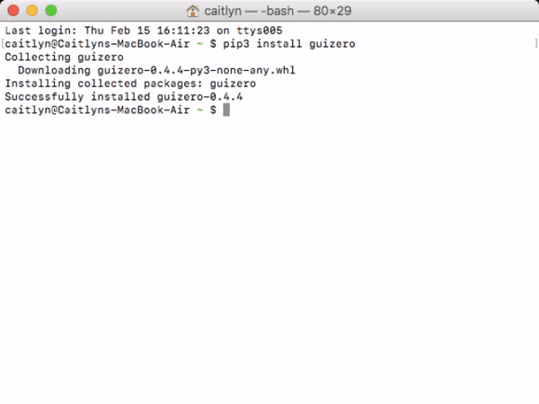
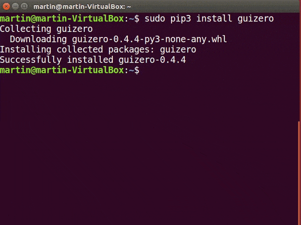

## Installing Python modules with pip

`pip` or `pip3` is a command line tool for installing Python 3 modules.

Modules can be downloaded as packages from the [Python Package Index](https://pypi.python.org/pypi) and installed on your computer automatically.

To install a module, use the `pip3 install name_of_module` command, replacing `name_of_module` with the module you wish to install.

Follow the instructions below for your operating system.

### Raspberry Pi

+ Open a terminal window by clicking **Menu** > **Accessories** > **Terminal**.

+ Enter this command to install a module:

```bash
sudo pip3 install name_of_module
```


If you experience problems, have a look at our guide [_Using pip on Raspberry Pi_](https://projects.raspberrypi.org/en/projects/using-pip-on-raspberry-pi).

### Windows

+ Open a command prompt by clicking **Start** > **Windows System** > **Command Prompt**, or by typing 'command' into the start menu's search bar.


+ Enter this command to install a module:

```bash
pip3 install name_of_module
```


If you experience problems, have a look at our guide [_Using pip on Windows_](https://projects.raspberrypi.org/en/projects/using-pip-on-windows).

### macOS

+ Open a terminal window by clicking **Applications** > **Utilities** > **Terminal**, or by typing 'terminal' into the desktop's search bar.

+ Enter this command to install a module:

```bash
pip3 install name_of_module
```



### Linux

+ Open a terminal window.

+ Enter this command to install a module:

```bash
sudo pip3 install name_of_module
```



### Other pip commands

There is comprehensive documentation for pip at [pip.pypa.io](https://pip.pypa.io); here are a few useful commands:

+ Upgrade an already installed module:

```bash
pip3 install --upgrade name_of_module 
```

+ Uninstall a module:

```bash
pip3 uninstall name_of_module
```

+ List installed modules:

```bash
pip3 list
```
