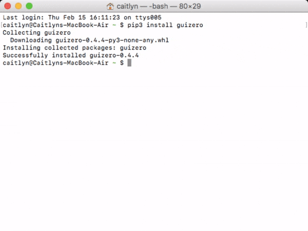
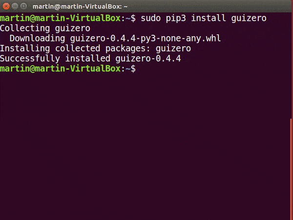

# Python-modules installeren met pip

`pip` of `pip3` is een opdrachtregelprogramma voor het installeren van Python 3-modules.

Modules kunnen worden gedownload als pakketten van de [Python Package Index](https://pypi.python.org/pypi) en automatisch op je computer worden geïnstalleerd.

Om een module te installeren, gebruik je de opdracht `pip3 install naam_van_module`, waarbij `naam_van_module` wordt vervangen door de module die je wilt installeren.

Volg de onderstaande instructies voor jouw besturingssysteem.

## Raspberry Pi

+ Open een terminalvenster door te klikken op **Menu** > **Accessoires** > **Terminal**.

+ Voer deze opdracht in om een module te installeren:

```bash
sudo pip3 install naam_van_module
```


Als je problemen ervaart, kijk dan in onze gids [_Pip gebruiken op Raspberry Pi_](https://projects.raspberrypi.org/en/projects/using-pip-on-raspberry-pi).

## Windows

+ Open een opdrachtprompt door te klikken op **Start** > **Windows Systeem** > **Opdrachtprompt**, of door 'command' te typen in de zoekbalk van het startmenu.


+ Voer deze opdracht in om een module te installeren:

```bash
pip3 install naam_van_module
```


Als je problemen ondervindt, raadpleeg je onze gids [_Pip gebruiken op Windows_](https://projects.raspberrypi.org/en/projects/using-pip-on-windows).

## macOS

+ Open een terminalvenster door op **Toepassingen** > **Hulpprogramma's** > **Terminal** te klikken of door 'terminal' in de zoekbalk van het bureaublad te typen.

+ Voer deze opdracht in om een module te installeren:

```bash
pip3 install naam_van_module
```



## Linux

+ Open een terminalvenster.

+ Voer deze opdracht in om een module te installeren:

```bash
sudo pip3 install naam_van_module
```



## Installatieproblemen oplossen

Er is uitgebreide documentatie voor pip op [pip.pypa.io](https://pip.pypa.io) die je zal helpen bij het oplossen van problemen. Hier zijn een paar van de veelvoorkomende zaken om je te helpen problemen op te sporen.

**Installatieproblemen**

Als de installatie van een pakket mislukt zie je misschien een foutmelding die lijkt op deze:

```bash
Kan geen versie vinden die aan de eis voldoet <package-name (from versions: )>
```

```bash
Geen overeenkomende distributie gevonden voor <package-name>
```

De meest voorkomende bron van deze fouten is een verkeerd gespelde pakketnaam.

Je moet ook controleren of je de pakketnaam en niet de modulenaam gebruikt. bijv. de pakketnaam voor PIL (Python Imaging Library) is `pillow` en niet `PIL`.

**Problemen met het importeren van modules**

Als het pakket installeert, maar er treedt een fout bij het importeren van de module, controleer dan het volgende:

1. In welke versie van Python installeert pip de pakketten?

    Als je meerdere versies van Python op je computer hebt, installeert pip mogelijk modules voor een andere versie dan degene die je programma gebruikt.

    Het kan een geval zijn van het gebruik van de juiste versie van het pip-commando, zorg ervoor dat je `pip3` gebruikt.

2. Staat het pakketje op de lijst met pakketten?

    Je kunt het volgende commando gebruiken om alle Python-pakketten te tonen die je hebt geïnstalleerd.

    ```bash
    pip3 list
    ```

## Een pakket upgraden

Wanneer je een Python-pakket installeert dat al op je computer staat, zal het niet naar de nieuwste versie updaten.

Gebruik dit commando om een Python-pakket bij te werken naar de nieuwste versie:

```bash
pip3 install --upgrade naam_van_module 
```

## Een pakket verwijderen

Gebruik dit commando om een Python-pakket te verwijderen:

```bash
pip3 uninstall naam_van_module
```
