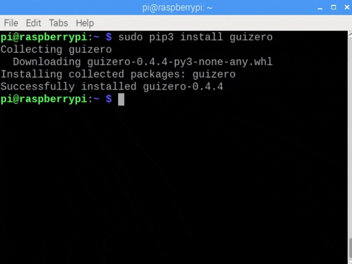

# Installing Python modules with pip

`pip` or `pip3` is a command line tool for installing Python 3 modules.

Modules can be downloaded as packages from the [Python Package Index](https://pypi.python.org/pypi) and installed on your computer automatically.

To install a module, use the `pip3 install name_of_module` command, replacing `name_of_module` with the module you wish to install.

Follow the instructions below for your operating system.

## Raspberry Pi

+ Open a terminal window by clicking **Menu** > **Accessories** > **Terminal**.

+ Enter this command to install a module:

```bash
sudo pip3 install name_of_module
```



If you experience problems, have a look at our guide [_Using pip on Raspberry Pi_](https://projects.raspberrypi.org/en/projects/using-pip-on-raspberry-pi).

## Windows

+ Open a command prompt by clicking **Start** > **Windows System** > **Command Prompt**, or by typing 'command' into the start menu's search bar.


+ Enter this command to install a module:

```bash
pip3 install name_of_module
```


If you experience problems, have a look at our guide [_Using pip on Windows_](https://projects.raspberrypi.org/en/projects/using-pip-on-windows).

## macOS

+ Open a terminal window by clicking **Applications** > **Utilities** > **Terminal**, or by typing 'terminal' into the desktop's search bar.

+ Enter this command to install a module:

```bash
pip3 install name_of_module
```


## Linux

+ Open a terminal window.

+ Enter this command to install a module:

```bash
sudo pip3 install name_of_module
```


## Troubleshooting installation issues

There is comprehensive documentation for pip at [pip.pypa.io](https://pip.pypa.io) which will help you with troubleshooting. Here are a few of the common issues, to help you identify problems.

**Installation issues**

If the installation of a package fails you may see an error message similar to these:

```bash
Could not find a version that satisfies the requirement <package-name (from versions: )>
```

```bash
No matching distribution found for <package-name>
```

The most common source of these errors is a misspelled package name.

You should also check that you are using the package name and not the module name. e.g. the package name for PIL (Python Imaging Library) is `pillow` and not `PIL`.

**Module import issues**

If the package installs but an error occurs when you try to import the module, check the following:

1. Which version of Python pip is installing packages into?

    If you have multiple versions of Python on your computer, pip might be installing modules for a different version than the one your program is using.

    It may be a case of using the right version of the pip command, make sure you are using `pip3`.

2. Is the package included in your package list?

    You can use the following command to list all the Python packages you have installed.

    ```bash
    pip3 list
    ```

## Upgrading a package

When you install a Python package that is already on your computer, it will not update it to the latest version.

Use this command to update a Python package to the latest version:

```bash
pip3 install --upgrade name_of_module 
```

## Uninstalling a package

Use this command to uninstall a Python package:

```bash
pip3 uninstall name_of_module
```
